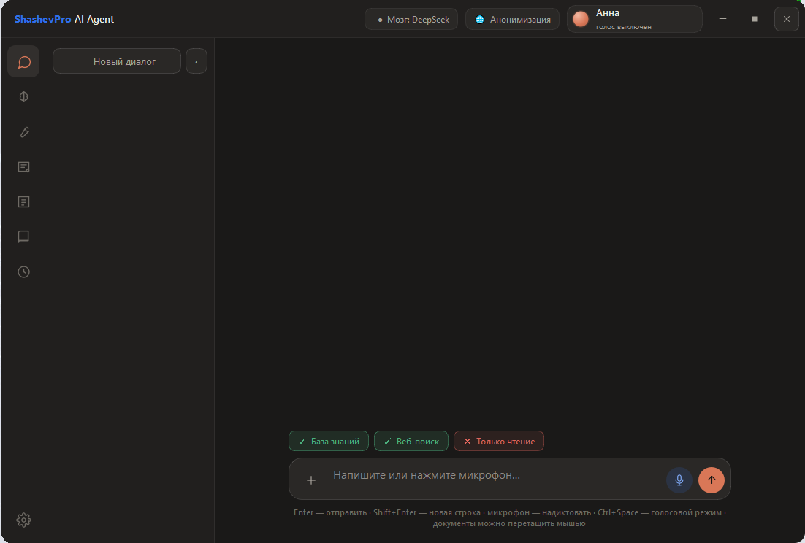
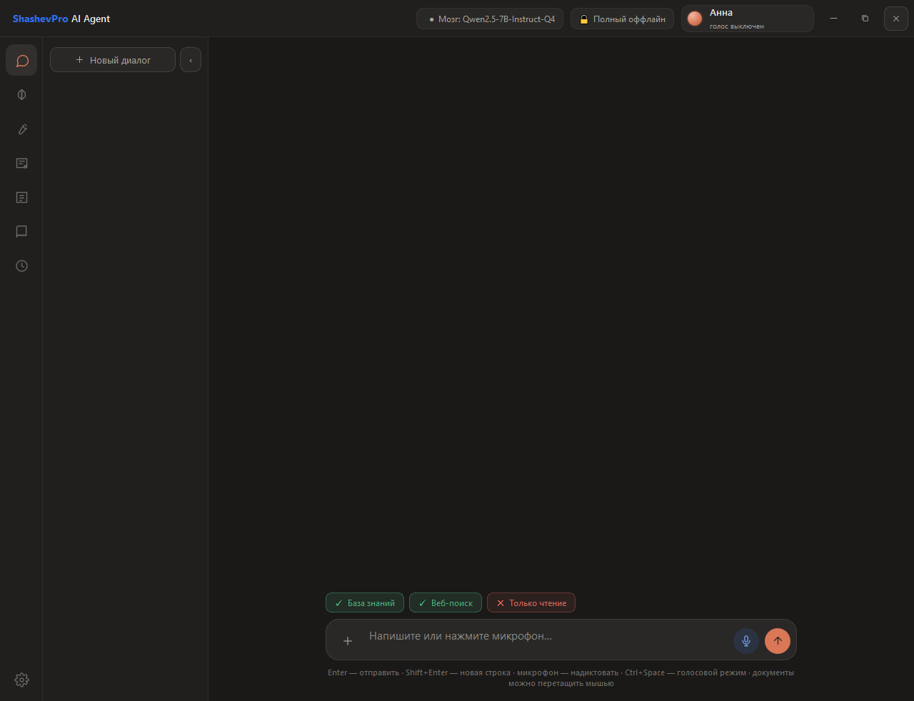
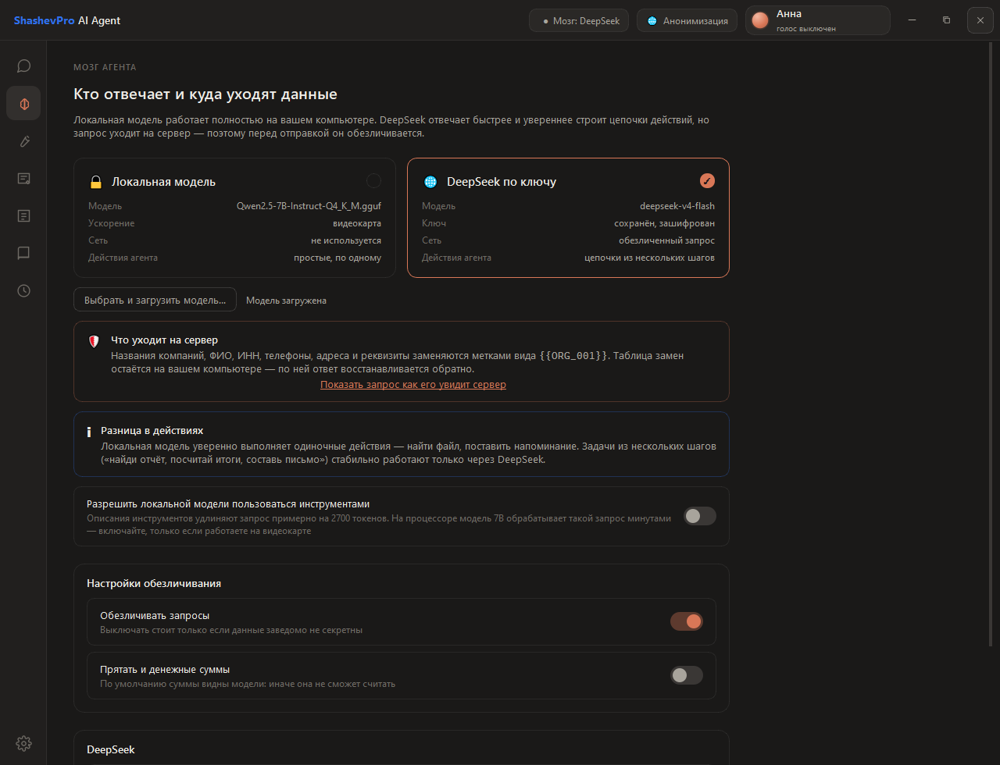
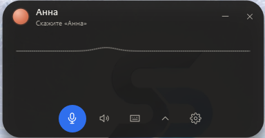
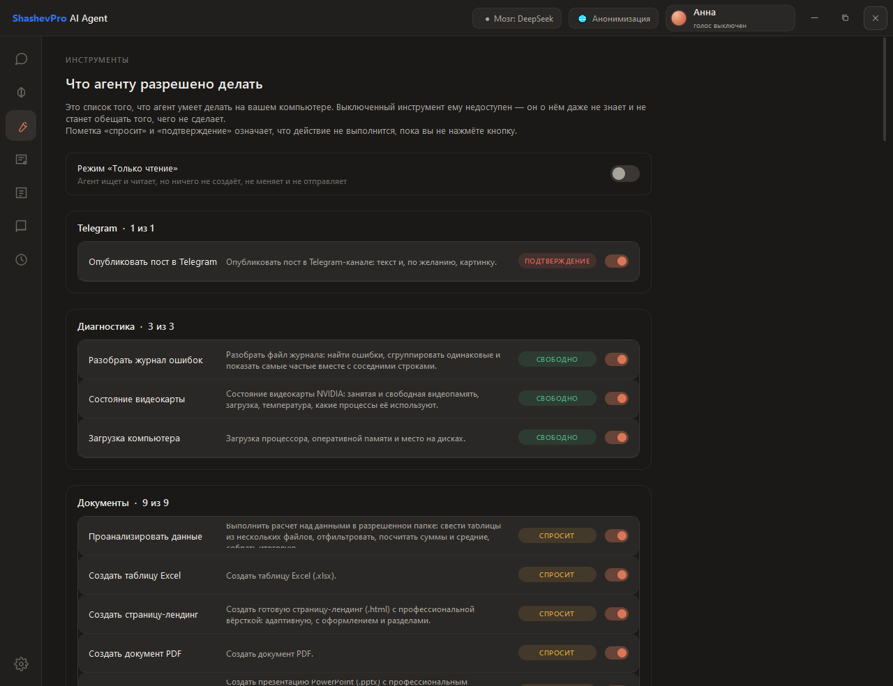
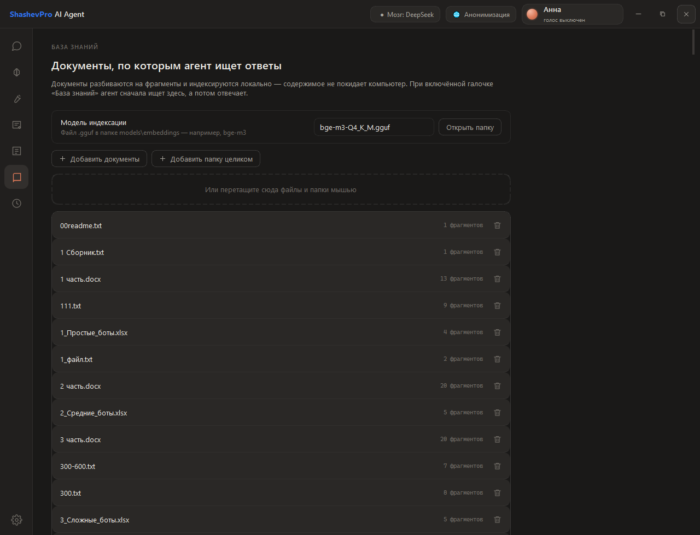
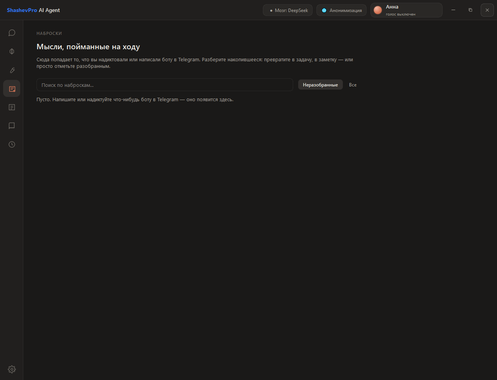
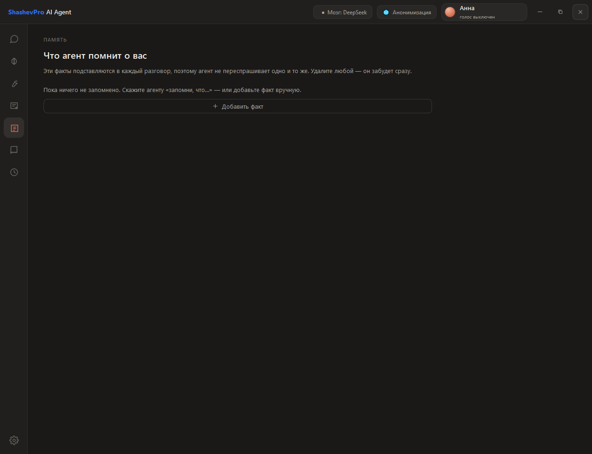
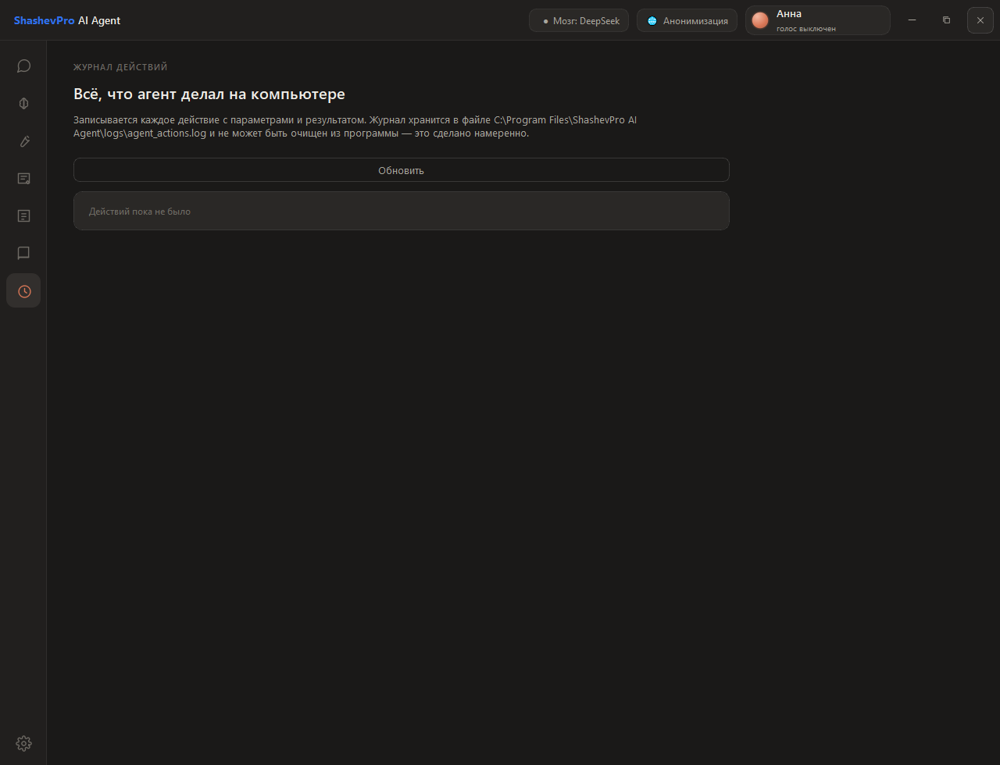
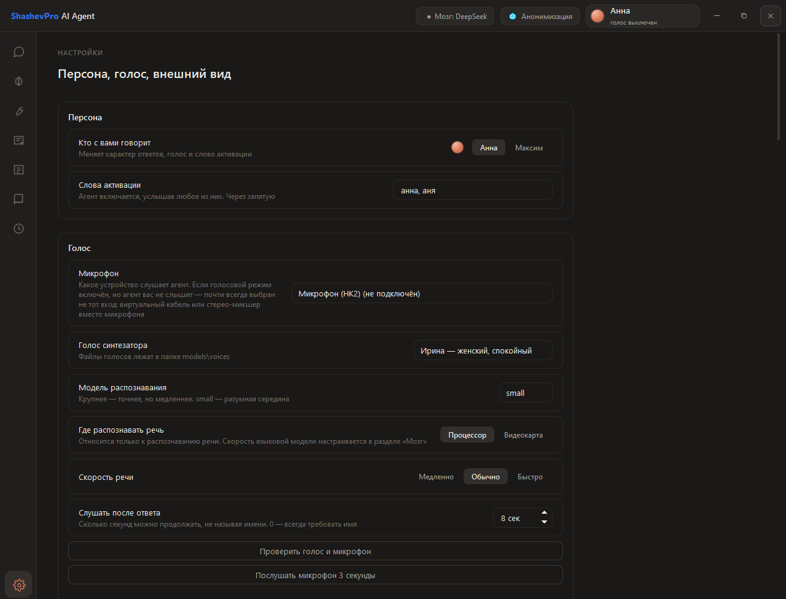

# ShashevPro AI Agent

**An AI agent for your work computer. Runs offline. Your data never leaves the machine.**

Version 1.13.8 · Windows 10/11 · 68 tools

[Русский](README.md) · [Website](https://shashevpro.ru) · [Changelog](CHANGELOG.md)

---

## What it is

A desktop application that understands plain speech and text and carries
out office work on its own: it writes documents, reads email, sets
reminders, finds files, publishes posts, watches your server.

Not a chatbot that gives advice — an agent that acts. Ask it to draft a
sales contract and put it on the desktop, and you get the file, not
instructions for making one.

**The key difference from cloud agents:** it can run fully offline. A
local model interprets tasks and calls tools without a single outbound
request. For accounting, legal, public sector, and anyone who cannot let
data leave the perimeter, that is not a nice-to-have — it is the
condition of purchase.

---

## Who it is for

| Audience | Why |
|---|---|
| Small and medium business | Document workflow without hiring for it |
| Accounting, legal | Sensitive data handled without any cloud |
| Companies with a closed IT perimeter | Fully local, zero telemetry |
| Managers | Voice assistant and phone access via Telegram/MAX |

---

## Capabilities

### Documents
Word, Excel, PDF, PowerPoint. Russian Excel function names (`=СУММ`,
`=ЕСЛИ`) are translated automatically, so files open without `#NAME?`
errors. Corporate templates filled in by placeholders. Presentations
built on the client's own `.potx` with their logo and colours.

### Voice mode
A complete offline loop: speech recognition, synthesis, wake word. Spoken
conversations are kept in their own chat.

### Phone access
Telegram and MAX. Same agent, same memory, same documents. Voice messages
are transcribed into notes.

### Email and calendar
Reads the inbox, drafts replies, shows upcoming events. Sending an email
always requires explicit confirmation.

### Knowledge base
Answers questions from your own documents — contracts, manuals, price
lists — and cites the source.

### Server monitoring
Reports the state of your server over an SSH key. **Read-only:** the
agent cannot change anything on the server — no such tools exist in it.

### Landing pages
A complete page as a single `.html` file: no external assets, opens
without internet, reads well on a phone.

---

## Security

The product is built to be sold to businesses, so control is part of the
architecture rather than an afterthought.

- **Three risk levels.** Reading runs silently; changes require
  confirmation; irreversible actions and anything leaving the machine
  always require it. Confirmation is by button only — a stray phrase in
  chat cannot trigger anything.
- **Folder allowlist.** The agent works only inside permitted folders.
  `Windows` and `Program Files` are out of reach by design.
- **Anonymisation.** Before anything goes to the cloud, names, company
  names, tax IDs and phone numbers are replaced with placeholders such as
  `{{ORG_001}}`. The mapping table stays on the machine. A button shows
  the request exactly as the server will see it — before it is sent.
- **Action journal.** Append-only; it cannot be erased from inside the
  program.
- **Keys and passwords** are stored encrypted on the machine.
- **No telemetry.** The program collects no usage statistics and sends
  nothing to the developer.

---

## Screenshots

### Chat with a cloud model (DeepSeek)

### Chat with a local model (Qwen, offline)

### Choosing the agent's brain

### Voice mode

### Tools

### Knowledge base

### Notes

### Agent memory

### Action journal

### Settings

---

## Requirements

|  | Minimum | Comfortable |
|---|---|---|
| OS | Windows 10 | Windows 10/11 |
| RAM | 8 GB | 16 GB or more |
| Disk | 1 GB | +5–10 GB for local models |
| GPU | not required | NVIDIA 6+ GB speeds up the local model |
| Internet | not required with a local model | needed for cloud model, email, bots |

Two builds: CPU-only and GPU-enabled. Delivered as a portable version or
an installer.

---

## Product roadmap

This is the first release of a commercial product. It is complete and
sold as is — not a beta, not a preview.

Development continues: upcoming versions will add an execution plan shown
before the task, a completion report with evidence, scheduled tasks, and
support for the customer's own tools. Every version is self-contained and
ready to sell; new capabilities are documented here and in the
[changelog](CHANGELOG.md).

---

## Licensing and deployment

This is commercial software. The source code is not published.

- Delivery: portable build or Windows installer
- Custom builds available: your document templates, your presentation
  branding, your integrations
- Website: [shashevpro.ru](https://shashevpro.ru)

---

**ShashevPro** · Krasnoyarsk, Russia · [shashevpro.ru](https://shashevpro.ru)

