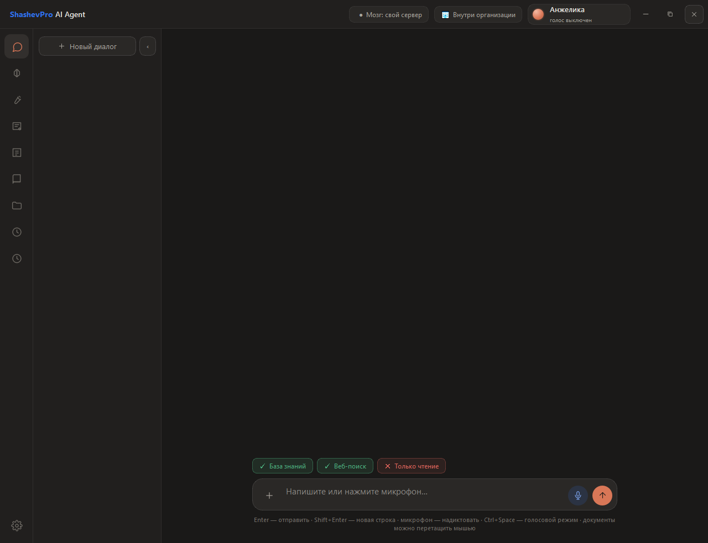
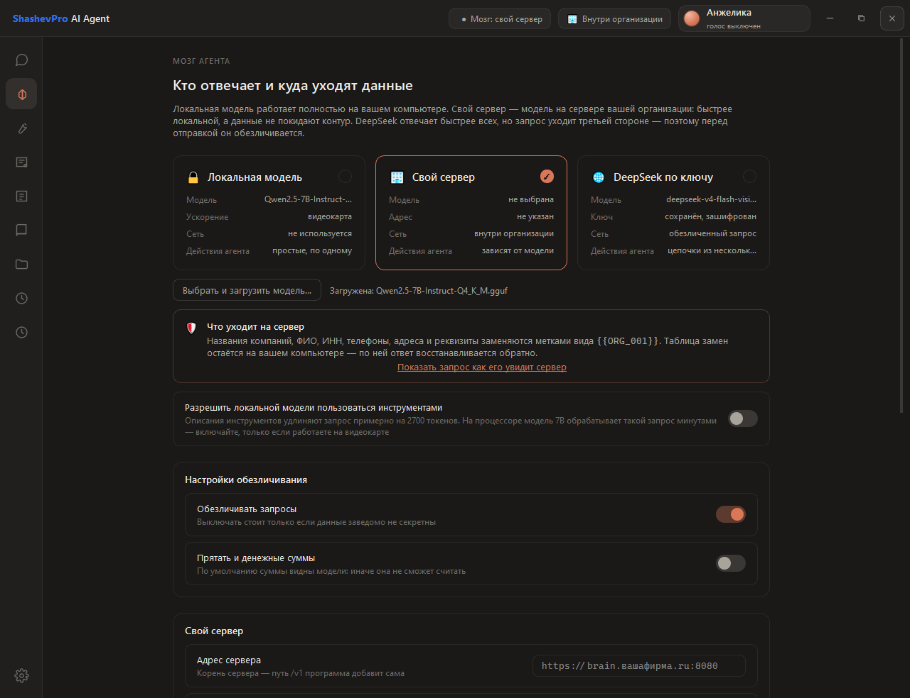
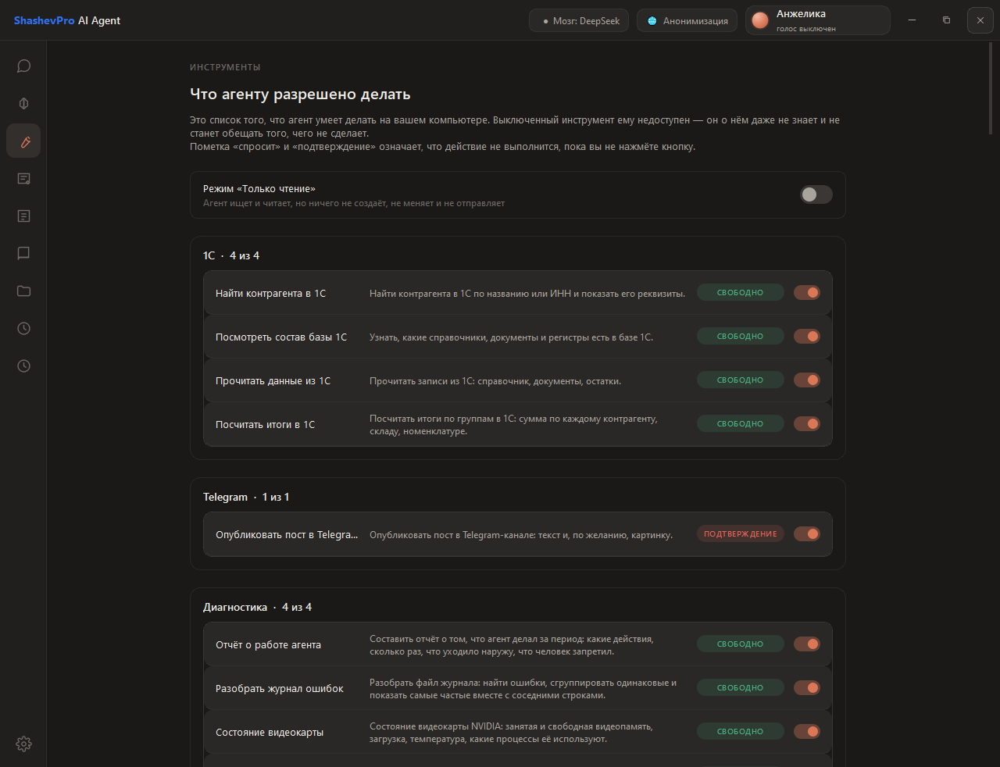
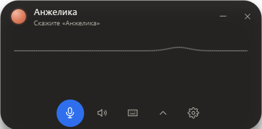
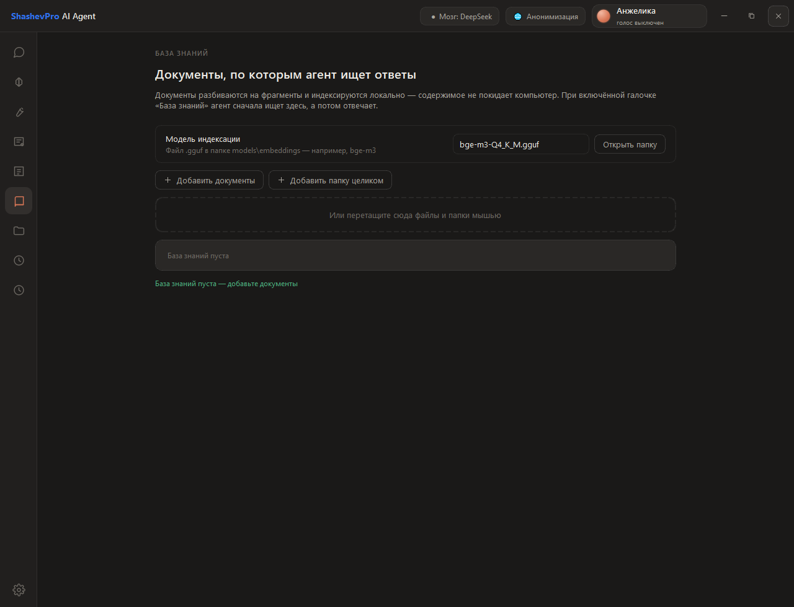
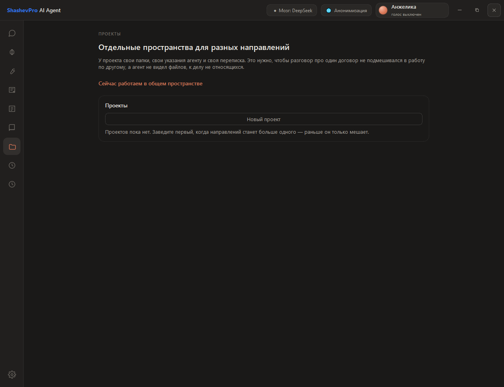
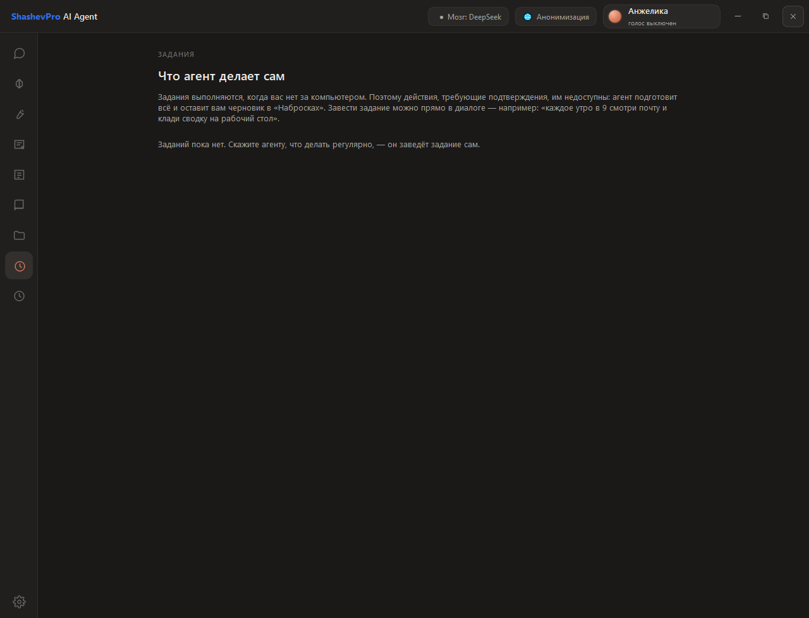
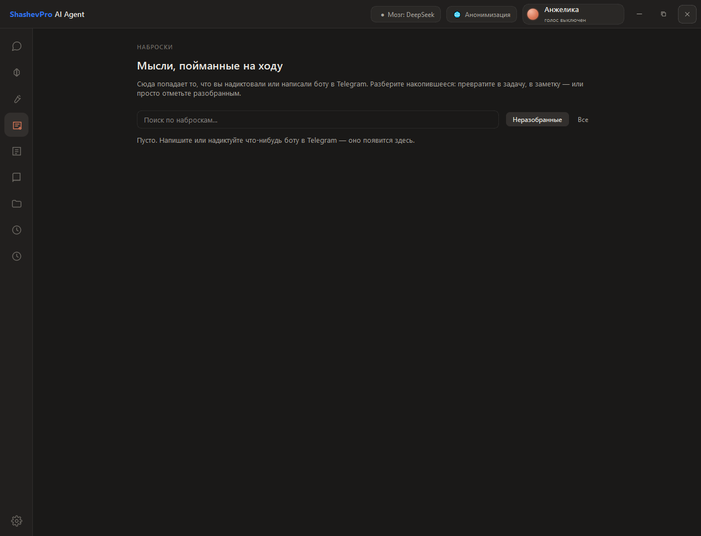
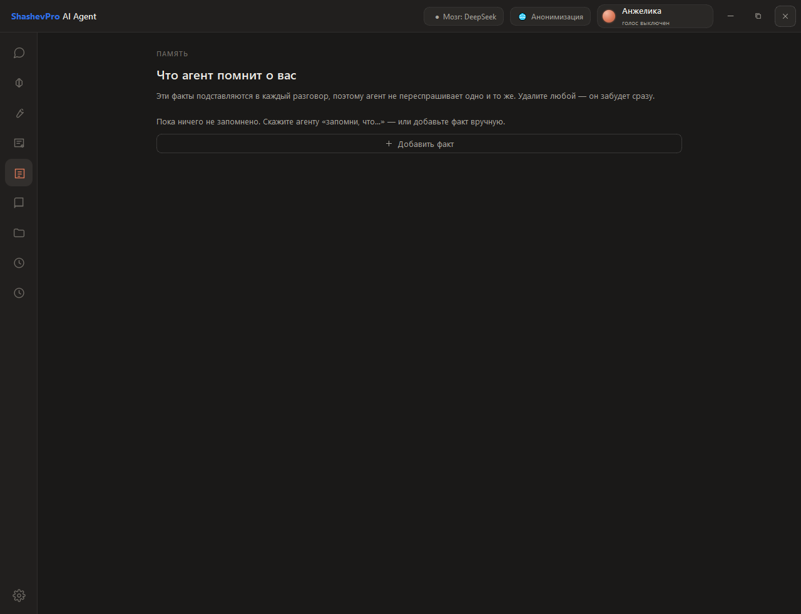
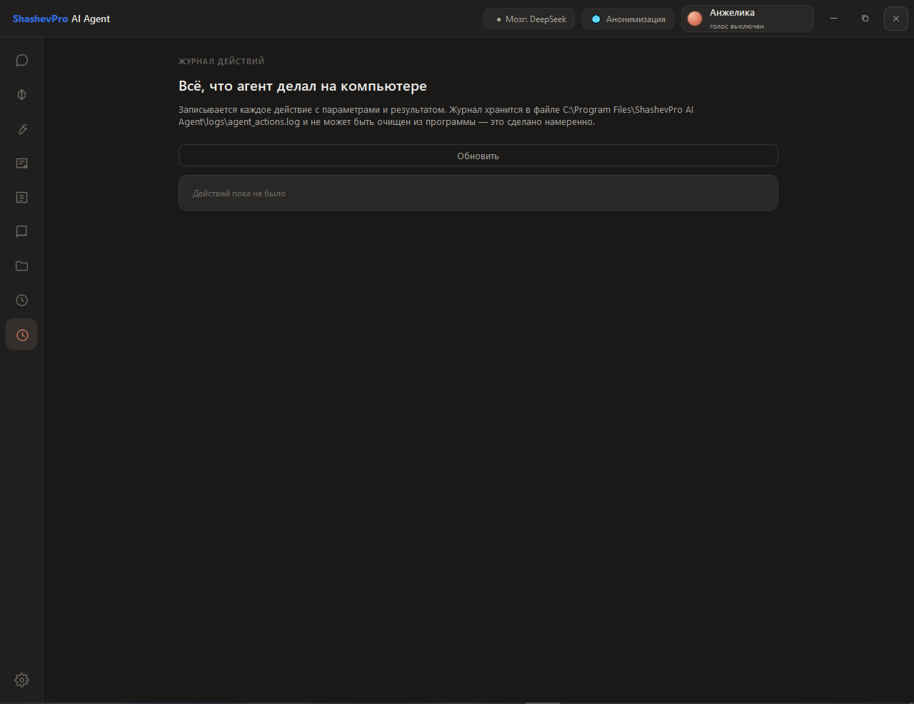

# ShashevPro AI Agent

**An AI agent for your work computer. Runs offline. Your data never leaves the machine.**

Version 2.0.0 · Windows 10/11 · 88 tools

[Русский](README.md) · [Website](https://shashevpro.ru) · [Changelog](CHANGELOG.md)

---

## What it is

A desktop application that understands plain speech and text and carries
out office work on its own: it writes documents, reads data from 1C,
handles email, sets reminders, finds files, takes meeting minutes,
watches your server.

Not a chatbot that gives advice — an agent that acts. Ask it to draft a
sales contract and put it on the desktop, and you get the file, not
instructions for making one.

**Where the model runs is your choice.** On this machine, on your company
server, or in the cloud. In the first two the data never leaves your
perimeter: for accounting, legal, public sector, and anyone who cannot
let data out, that is not a nice-to-have — it is the condition of
purchase.

---

## What is new in version 2

| | |
|---|---|
| **1C data** | Counterparties, stock, documents, totals by group. Read-only: no writing tools exist in the product at all |
| **Your own company server** | The model on a company server: cloud speed while requests never leave the perimeter |
| **A visible plan** | Given a multi-step task, the agent shows its steps and ticks them off as it goes |
| **Vision** | Understands scans, photos of documents and what is on screen — not just character recognition |
| **Scheduled jobs** | “Every morning at 9 check the mail and put a summary on the desktop” — the agent creates the job itself |
| **Meeting minutes** | Recording, live transcript, finished minutes: what was discussed, what was decided, who does what |
| **Projects** | Separate spaces: own folders, own instructions and own history per area of work |
| **Dictation into any window** | The text lands where the cursor is: in Word, in 1C, in a browser field |
| **Revision comparison** | “What changed in the new version of the contract” — word by word, not paragraph by paragraph |
| **Batch processing** | “From every invoice in this folder take the supplier, number and amount” — collected into one Excel sheet |
| **Activity report** | For management and security: what the agent did over a period, what went outside |

---

## Who it is for

| Audience | Why |
|---|---|
| Small and medium business | Document workflow without hiring for it |
| Accounting, legal | Sensitive data handled without any cloud |
| Companies with a closed IT perimeter | Fully local, or your own server; zero telemetry |
| Managers | Voice assistant and phone access via Telegram/MAX |

---

## Capabilities

### 1C data
Counterparties, stock, documents, totals by group — “the three largest
suppliers” is one query across the whole database. Works with a file
database on disk and with one published on a web server. **Read-only:**
the product has no tools that write to 1C, so a settings mistake or a
misread question cannot corrupt the books.

### Documents
Word, Excel, PDF, PowerPoint. Russian Excel function names (`=СУММ`,
`=ЕСЛИ`) are translated automatically, so files open without `#NAME?`
errors. Corporate templates filled in by placeholders. Presentations
built on the client's own `.potx` with their logo and colours.

### Voice mode
A complete offline loop: speech recognition, synthesis, wake word. You
can interrupt the agent — it keeps listening while it speaks. The name is
yours to choose; the wake words follow it automatically.

### Phone access
Telegram and MAX. Same agent, same memory, same documents. Voice messages
are transcribed into notes.

### Email and calendar
Reads the inbox, drafts replies, shows upcoming events. Sending an email
always requires explicit confirmation.

### Knowledge base
Answers questions from your own documents — contracts, manuals, price
lists — and cites the source. Indexing is local: the content never leaves
the machine.

### Server monitoring
Reports the state of your server over an SSH key. **Read-only:** the
agent cannot change anything on the server — no such tools exist in it.

### Landing pages
A complete page as a single `.html` file: no external assets, opens
without internet, reads well on a phone.

---

## Security

The product is built to be sold to businesses, so control is part of the
architecture rather than an afterthought.

- **Three risk levels.** Reading runs silently; changes require
  confirmation; irreversible actions and anything leaving the machine
  always require it. Confirmation is by button only — a stray phrase in
  chat cannot trigger anything.
- **Folder allowlist.** The agent works only inside permitted folders.
  `Windows` and `Program Files` are out of reach by design.
- **Read-only mode.** One switch strips the agent of every tool that
  changes anything.
- **Anonymisation.** Before anything goes to the cloud, names, company
  names, tax IDs and phone numbers are replaced with placeholders such as
  `{{ORG_001}}`. The mapping table stays on the machine. A button shows
  the request exactly as the server will see it — before it is sent.
- **Action journal.** Append-only; it cannot be erased from inside the
  program.
- **Keys and passwords** are stored encrypted on the machine.
- **No telemetry.** The program collects no usage statistics and sends
  nothing to the developer.

---

## Screenshots

### Chat

### The agent's brain: local model, your own server or the cloud

### Tools: what the agent is allowed to do

### Voice mode

### Knowledge base

### Projects

### Jobs: what the agent does on its own

### Notes

### Agent memory

### Action journal

### Settings

---

## Requirements

|  | Minimum | Comfortable |
|---|---|---|
| OS | Windows 10 | Windows 10/11 |
| RAM | 8 GB | 16 GB or more |
| Disk | 1 GB | +5–10 GB for local models |
| GPU | not required | NVIDIA 6+ GB speeds up the local model |
| Internet | not required with a local model | needed for cloud model, email, bots |
| 1C | not required | needed on the same machine for file databases |

Two builds: CPU-only and GPU-enabled. Delivered as a portable version or
an installer.

---

## Server component

**ShashevPro Brain Server** is a separate distribution: the model on a
company server, available to every workstation. Cloud speed while the
data stays inside the perimeter.

Installs on Linux with a single command, inspects the machine itself and
picks the engine and model for the number of employees. Tokens are issued
per person; each employee gets a `.spbrain` connection file.

Server and agent versions need not match: they talk over the OpenAI
protocol, so the agent also works with llama.cpp, vLLM, Ollama and
LM Studio.

---

## Product roadmap

This is the second release. Every version is self-contained and sold as
is — not a beta, not a preview.

Development continues; new capabilities are documented here and in the
[changelog](CHANGELOG.md).

---

## Licensing and deployment

This is commercial software. The source code is not published.

- Delivery: portable build or Windows installer
- Custom builds available: your document templates, your presentation
  branding, your integrations
- Website: [shashevpro.ru](https://shashevpro.ru)

---

**ShashevPro** · Krasnoyarsk, Russia · [shashevpro.ru](https://shashevpro.ru)

